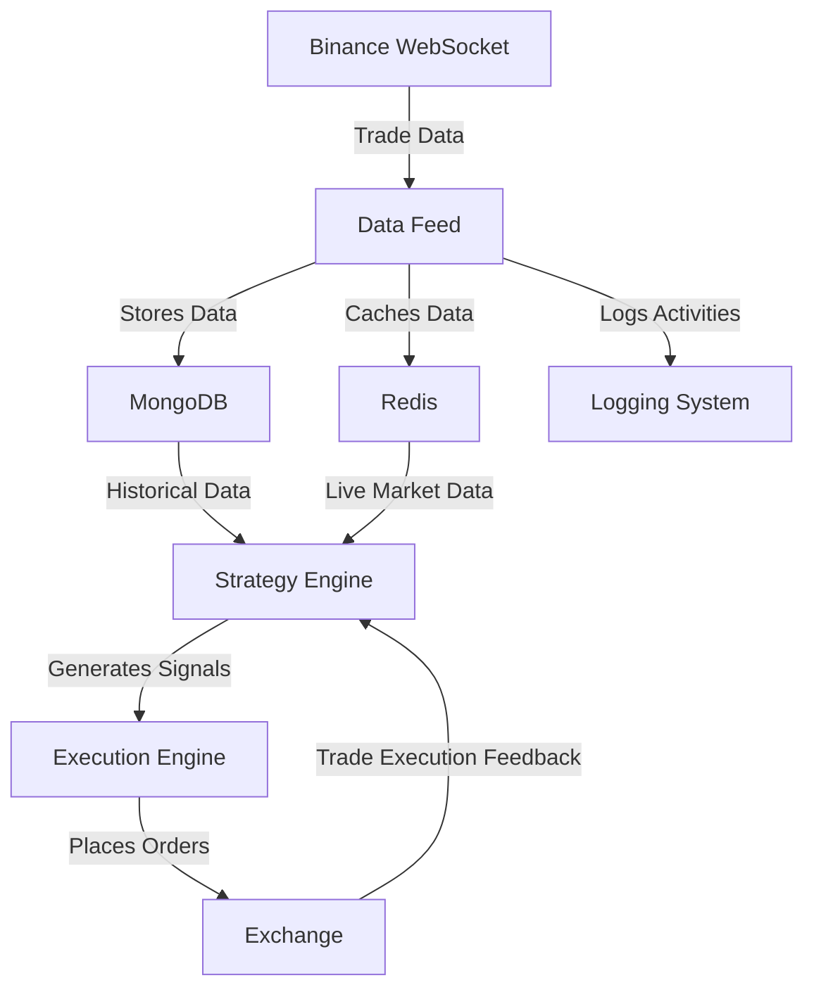

# 🚀 Algorithmic Trading System

This project is a **high-frequency algorithmic trading system** that integrates **Binance WebSockets, MongoDB, Redis, and Docker** to process real-time trade data efficiently.

---

## 📌 Features

- ✅ **Real-time market data streaming** from Binance WebSockets  
- ✅ **MongoDB storage** for structured trade data  
- ✅ **Redis caching** for fast trade execution  
- ✅ **Dockerized deployment** for seamless setup  
- ✅ **Explicit Logging** for program monitoring  
- ✅ **Unit Tests** for program check  
- ✅ **Metrics Monitoring** for performance control  
- ✅ **Multiple Instance Handling**  

---

## 📂 Project Architecture  


## 🔍 Overview of Components  
**Data Feed**: Listens to *Binance WebSocket*, processes trade data, and logs activities.  
**MongoDB**: Stores historical trade data for analysis.  
**Redis**: Caches live trade data for *quick access*.  
**Strategy Engine**: Analyzes market conditions and generates buy/sell signals.  
**Execution Engine**: Places and manages orders with the exchange.  
**Logging System**: Tracks system activities, errors, and trade execution.  

## 🛠 Installation & Setup  

### 🔹 Prerequisites  
Ensure you have the following installed:  
- **Docker & Docker Compose**  
- **Python 3.10+**  
- **pip (Python package manager)**  

### 🔹 Clone the Repository  
```sh
git clone https://github.com/demirhanizer/AlgoTrading.git
cd AlgoTrading 

```
### 🔹 Setup Environment Variables
Create a .env file in the root directory and add the following:
```sh
BINANCE_API_KEY=your_binance_api_key  
BINANCE_SECRET_KEY=your_binance_secret_key
```

### 🔹 Build and Start the Containers
```sh
docker compose build
docker compose up -d

```
### 🔹 Stop the Containers
```sh
docker compose down
```
This will:  
- ✅ Set up MongoDB & Redis
- ✅ Start the Data Feed
- ✅ Initialize the Strategy Engine & Execution System

### 📜 Usage 
Once the system is running, it will:
- ✅ Fetch live trade data from Binance WebSockets.   
- ✅ Store data in MongoDB for further analysis.  
- ✅ Cache trade data in Redis for high-speed execution.  
- ✅ Run the trading strategy to generate signals.  
- ✅ Execute trades automatically based on signals.

### Strategies
The strategy in this trading system is based on Simple Moving Average (SMA) Crossover and 
can be dynamically changed using key parameters in **strategy.py**.

### 📌 Strategy Parameters
📌 Modify the strategy.py file

Open strategy.py and change the desired parameter:
| **Parameter**            | **Description**                                             | **Options**                | **Impact on Strategy**                           | **File Name**   |
|--------------------------|-------------------------------------------------------------|----------------------------|--------------------------------------------------|-----------------|
| `EXECUTION_MODE`         | Defines execution type                                      | `"HFT"`, `"TIME_BASED"`    | Real-time trading vs. batch trading              | `strategy.py`   |
| `TIME_UNIT`              | Defines time unit                                           | `"seconds"`, `"minutes"`   | Determines SMA granularity                        | `strategy.py`   |
| `DATA_COLLECTION_MODE`   | Defines trade data handling                                 | `"STRICT"`, `"FLEXIBLE"`   | Affects how trades are gathered                  | `strategy.py`   |
| `SHORT_WINDOW`           | Short SMA period                                            | Integer (e.g., 50)         | Affects signal sensitivity                       | `strategy.py`   |
| `LONG_WINDOW`            | Long SMA period                                             | Integer (e.g., 200)        | Determines trend direction                       | `strategy.py`   |
| `ORDER_COOLDOWN_SECONDS` | Defines a cooldown period after the last trade before new trades are allowed | Integer (e.g., 60)         | Prevents immediate consecutive trades within the cooldown window | `execute.py`     |


### 📑 Checking Logs  

To **monitor system logs** and debug issues, follow these steps:

### 🔍 Accessing the Log Files  
First, enter the container where the logs are stored:

```sh
docker exec -it data_feed bash
```

Then navigate to the logs directory:
```sh
cd /app/logs
```

### 📜 Viewing Specific Log Files
```sh
tail -f data_feed.log
```

### Checking Other Logs  
Same as given above but now there needs to be opened necessary container with docker exec -ti <container-name> command, and inside find the necessary log file.

### Monitor 
In order to monitor the system usage, there has been implemented Grafana with Prometheus. You need to open the comments inside *docker-compose.yml* then rebuild and restart the containers given as in *Build and Start the Containers* section.
